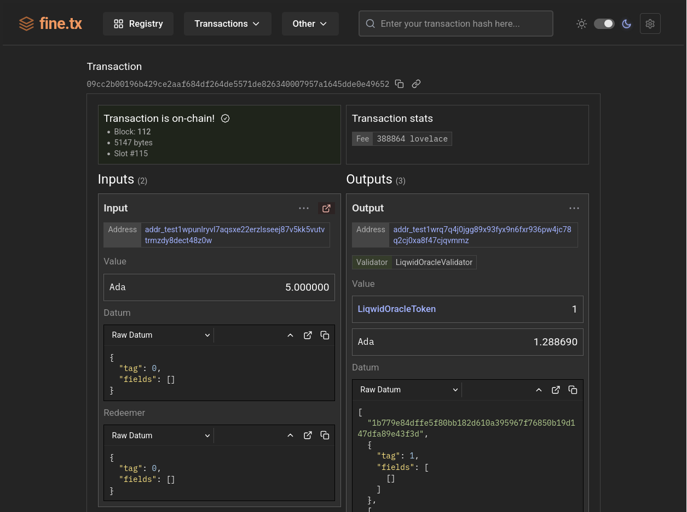

# utxo.run

A feature... fine transaction viewer. Especially useful for local devnet debugging!

## Screenshot

## Dependencies

utxo.run depends on `betterfrost` (or `blockfrost`) and _optionally_ `ogmios`. Configure `.env` based on the example `.env.example`.

## proxy server

A proxy server is provided in `proxy.ts`. This can be started with `bun run build-proxy`. It has a number of specific features that are
useful for local devnet deployment.

- Proxy to `betterfrost` and `ogmios` (if configured)
- Proxy to the registry
- Serve the assets and site
